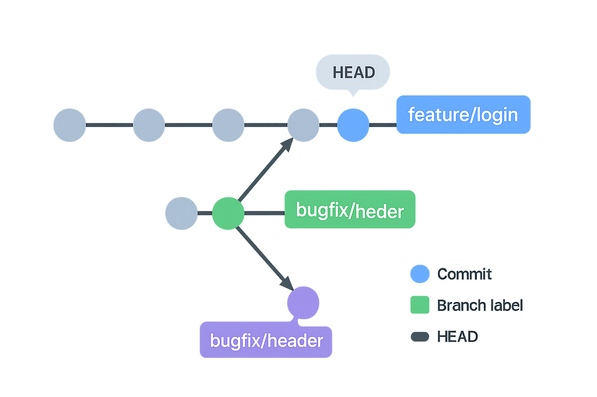

# Git and GitHub — complete lesson “from scratch”

> File language: [IT](README.it.md) * [EN]

This lesson is designed for people who **have never used Git or GitHub**. We start from the problem they solve, learn the concepts one by one, and then practice with real commands. By the end you’ll have a clear daily workflow and know what to do when things “get stuck”.

---

0. [Why Git and GitHub exist](#0)
1. [Core concepts (nothing assumed)](#1)
2. [Installation and first-time setup](#2)
3. [Create or clone a repository](#3)
4. [The basic workflow (always the same)](#4)
5. [What `git add` really does](#5)
6. [`git commit` explained (what the flags mean)](#6)
7. [`.gitignore` (what should not go into history)](#7)
8. [Viewing differences and history](#8)
9. [What GitHub is and when to use it](#9)
10. [Syncing: `fetch`, `pull`, and “divergent branches”](#10)
11. [Branching: why it exists and how to use it](#11)
12. [Merge vs Rebase: practical differences](#12)
13. [Merge conflicts: how to spot and resolve them](#13)
14. [Going back safely](#14)
15. [Parking work with `git stash`](#15)
16. [Working well with GitHub](#16)
17. [Guided exercise (do it for real)](#17)
18. [Typical errors and quick fixes](#18)
19. [Final cheatsheet](#19)
20. [One-line recap](#20)

---

<h2 id="0">0) Why Git and GitHub exist</h2>

Imagine working on a project and saving files like `project_final_DEF2_really.zip`. After a few days you no longer remember **what** changed, **when**, and **why**. If you collaborate with someone, emailing files back and forth is a nightmare.

**Git** solves this: it keeps a **history** of your project, like a time machine. Each “snapshot” is a **commit**.
**GitHub** hosts an online (remote) copy of your project so you can **publish**, **collaborate**, and **back up** your work.

---

<h2 id="1">1) Core concepts (nothing assumed)</h2>

* **Repository (repo)**: project folder containing a hidden `.git/` subfolder. Inside `.git/` lives the entire **history**.
* **Working tree**: the “normal” files on disk where you edit code.
* **Staging area (index)**: the “list of things” that will go into the **next commit**.
* **Commit**: a snapshot of the staged files plus a **message** explaining what you did.
* **HEAD**: a pointer telling you **where you are** in history (usually points to the current **branch**).
* **Branch**: a line of development with a name (e.g., `main`, `feature/login`). Work on changes **without touching** stable code.
* **Remote (e.g., `origin`)**: the online copy of the repo, typically on GitHub.

**Mental model:** Git is a **graph** of commits. Branches are just **labels** pointing to a commit.



---

<h2 id="2">2) Installation and first-time setup</h2>

Check that Git is installed:

```bash
git --version
```

Configure your name and email (they appear in history):

```bash
git config --global user.name  "Your Name"
git config --global user.email "you@email.com"
git config --global init.defaultBranch main
git config --global core.editor "code --wait"    # use VS Code for commit messages
```

Set a sensible default for `git pull` (explained in §10):

```bash
git config --global pull.rebase true
git config --global rebase.autoStash true
```

Passwordless GitHub access (recommended):

```bash
ssh-keygen -t ed25519 -C "you@email.com"
# copy ~/.ssh/id_ed25519.pub to GitHub → Settings → SSH and GPG keys
```

---

<h2 id="3">3) Create or clone a repository</h2>

### 3.1. Create a new **local** repo

```bash
mkdir my-project && cd my-project
git init
```

### 3.2. Create a new repo **on GitHub**

* Go to github.com → “New” → choose a name.
* Leave it empty if you want to initialize from local (or add a README).

Connect the remote and publish:

```bash
git remote add origin git@github.com:user/my-project.git
git add .
git commit -m "Initialize project"
git push -u origin main
```

`-u` sets the tracking relation between your local branch and the remote one. From now on, plain `git push` is enough.

### 3.3. Clone an **existing** online repo (most common)

```bash
git clone git@github.com:user/repo.git
cd repo
```

---

<h2 id="4">4) The basic workflow (always the same)</h2>

1. **See what changed**

```bash
git status
```

2. **Choose what to photograph** (stage it)

```bash
git add file1 file2     # selective
git add .               # everything that changed in the current folder
```

3. **Take the photo** (commit)

```bash
git commit -m "feat: add login form"
```

4. **Publish online** (push)

```bash
git push
```

> Until you `git push`, your changes **exist only on your computer**.

---

<h2 id="5">5) What `git add` really does</h2>

`git add` **takes the current version** of a file and **puts it in staging**: that content goes into the **next commit**. It doesn’t create a commit and doesn’t send anything to GitHub.

* **New** file → starts being tracked and staged.
* **Modified tracked** file → the modifications go to staging.
* **Deleted** file → use `git add -A` or `git add -u` to stage deletions too.
* **Listed in `.gitignore`** → ignored (you can force with `git add -f`).

Common mistake: “not staged” **doesn’t** mean “in `.gitignore`”. `.gitignore` is an **exclusion list**; staging is **what to include** in the next commit.

Unstage:

```bash
git restore --staged path/file
```

---

<h2 id="6">6) `git commit` explained (what the flags mean)</h2>

### 6.1. Classic commit

```bash
git commit -m "message"
```

* `-m` = **message**. Provide the message inline.

### 6.2. Commit without `git add` (only already-tracked files)

```bash
git commit -am "message"
```

* `-a` = **all (tracked)**: **automatically stages** modifications and deletions of **already tracked** files.
  It does **not** include **new** files: those still need `git add` first.
* `-am` is just `-a` plus `-m`.

### 6.3. Amend the last commit

```bash
git commit --amend
```

* Fix the message or add/remove files to the **same** previous commit.
  If it was already pushed, you’ll need `--force-with-lease` when pushing your branch.

---

<h2 id="7">7) `.gitignore` (what should not go into history)</h2>

Typical example:

```gitignore
# OS/editor files
.DS_Store
.vscode/

# builds and dependencies
dist/
node_modules/

# secrets and local config
.env
```

If you’ve **already** committed something that should be ignored:

```bash
git rm -r --cached path/to/ignore
echo "path/to/ignore" >> .gitignore
git commit -m "chore: update .gitignore and untrack files"
```

---

<h2 id="8">8) Viewing differences and history</h2>

```bash
git status -sb                    # compact overview
git diff                          # unstaged changes
git diff --staged                 # staged changes
git log --oneline --graph --decorate --all
git show <sha>                    # commit details
git blame path/file               # who changed each line and when
```

---

<h2 id="9">9) What GitHub is and when to use it</h2>

* It’s the “cloud place” where your **remote copy** lives.
* Use it to **collaborate**: open **Pull Requests** (PR) to propose changes, get **reviews**, run **CI** (GitHub Actions).
* You can also publish static sites with **GitHub Pages**.

Typical collaboration flow:

1. Create a **feature branch**.
2. Commit and push.
3. Open a **Pull Request** to `main`.
4. Someone reviews → you address comments → **merge**.

---

<h2 id="10">10) Syncing: `fetch`, `pull`, and “divergent branches”</h2>

* `git fetch` **downloads** updates from the remote but **doesn’t** touch your files.
* `git pull` = `fetch` **+** integrating those updates into your branch (merge or rebase).

If you see:

```
hint: You have divergent branches and need to specify how to reconcile them.
```

it means **both you and the remote have new commits**. Tell Git **how** to reconcile them:

* **Rebase** (linear history, recommended for personal projects):

  ```bash
  git pull --rebase
  ```
* **Merge** (branched history, conservative):

  ```bash
  git pull --no-rebase
  ```
* **Fast-forward only** (allow only linear fast-forwards):

  ```bash
  git pull --ff-only
  ```

Set a global default **once**:

```bash
git config --global pull.rebase true       # prefer linear rebase
# or:
git config --global pull.rebase false      # prefer merge
# or:
git config --global pull.ff only           # fast-forward only
```

---

<h2 id="11">11) Branching: why it exists and how to use it</h2>

**Without** branches: you always work on `main`. If you break something, you block everyone.
**With** branches: open a dedicated “line of work” per feature; when ready, merge into `main`.

Essential commands:

```bash
git branch                        # list branches (asterisk = current)
git checkout -b feature/login     # create and switch
# modern equivalent: git switch -c feature/login
git checkout main                 # go back to main  (or: git switch main)
git merge feature/login           # merge into main
git branch -d feature/login       # delete branch (after merge)
git push -u origin feature/login  # publish branch on GitHub
```

**HEAD** tells you which branch/commit you’re on.
“Detached HEAD”? You’re on a commit without a branch: create one if you want to continue from there:

```bash
git switch -c hotfix/urgent
```

---

<h2 id="12">12) Merge vs Rebase: practical differences</h2>

**Merge**

* Creates a **merge commit** when needed to join two histories.
* Pros: doesn’t rewrite history; safe for shared branches.
* Cons: history includes merge commits and can look “branched”.

**Rebase**

* “Reapplies” your commits on top of a newer base.
* Pros: **linear** history, easier to read.
* Cons: **rewrites** the branch’s commits; don’t do it on commits already shared with others (you may need `git push --force-with-lease`).

Examples:

```bash
# Typical merge
git switch main
git pull
git merge feature/x

# Rebase to clean up a feature before the PR
git switch feature/x
git fetch origin
git rebase origin/main
# resolve conflicts → git add <file> → git rebase --continue
```

---

<h2 id="13">13) Merge conflicts: how to spot and resolve them</h2>

When two people change **the same part** of a file in different ways, Git can’t choose. It marks a conflict with **markers** inside the file:

```text
a = 1
<<<<<<< HEAD
b = 2
=======
b = 3
>>>>>>> 56782736387980937883
c = 3
```

Procedure:

```bash
# 1) choose what to keep and remove the markers
git add <resolved_file>
# 2) finish:
git rebase --continue    # if rebase
git commit               # if merge
# Abort if needed:
# git rebase --abort | git merge --abort
```

Shortcuts:

```bash
git checkout --ours   -- path/file
git checkout --theirs -- path/file
```

---

<h2 id="14">14) Going back safely</h2>

* **Discard unstaged changes**:

  ```bash
  git restore path/file
  git restore --source=HEAD -- .
  ```
* **Undo a commit while keeping history**:

  ```bash
  git revert <sha>
  ```
* **Rewrite local history** (careful):

  ```bash
  git reset --soft  <sha>   # keep staging and working tree
  git reset --mixed <sha>   # default: clear staging, keep working tree
  git reset --hard  <sha>   # lose local modifications
  ```
* **Align exactly to the remote**:

  ```bash
  git reset --hard origin/main      # or origin/master in older repos
  ```
* **Parachute**:

  ```bash
  git reflog
  ```

If you committed **secrets** (tokens, passwords): rotate/invalidate them and rewrite history with `git filter-repo` or **BFG Repo-Cleaner**.

---

<h2 id="15">15) Parking work with `git stash`</h2>

```bash
git stash            # save changes (tracked files)
git stash -u         # include untracked files too
git stash pop        # apply and remove from stash
git stash apply      # apply but keep in stash
git stash -p         # interactively (“in pieces”)
```

---

<h2 id="16">16) Working well with GitHub</h2>

**Clean Pull Request flow**

1. `git checkout -b feature/x`
2. Small commits, clear messages
3. `git fetch && git rebase origin/main` before opening the PR
4. Open PR on GitHub (describe what you did and how to test)
5. After review, **Squash merge** into `main`

**Fork**: a copy of someone else’s repo under your account (to propose changes).
**GitHub Pages**: publish a static website

1. repo with `index.html`
2. `git push`
3. Settings → Pages → choose branch → get the URL.

---

<h2 id="17">17) Guided exercise (do it for real)</h2>

```bash
mkdir try-git && cd try-git
git init
echo "hello" > index.txt
git add index.txt
git commit -m "feat: add index.txt"

echo "line2" >> index.txt
git commit -am "feat: add line 2 to index.txt"

git checkout -b feature/greeting
echo "hello world" >> index.txt
git commit -am "feat: add greeting"

git checkout main
git merge feature/greeting

git remote add origin git@github.com:YOUR-USER/try-git.git
git push -u origin main
```

---

<h2 id="18">18) Typical errors and quick fixes</h2>

* **“non-fast-forward” on push** → `git pull --rebase` → resolve conflicts → `git push`
* **“detached HEAD”** → `git switch -c branch-name`
* **`.gitignore` “doesn’t work”** → `git rm -r --cached path/` → update `.gitignore` → commit

---

<h2 id="19">19) Final cheatsheet</h2>

```bash
# Initialize / clone
git init
git clone <URL> && cd repo

# Status and diffs
git status -sb
git diff
git diff --staged

# Add and commit
git add -p
git commit -m "message"
git commit -am "message"     # -a = all (tracked only), -m = message

# Publish
git push -u origin <branch>

# Sync
git fetch
git pull --rebase             # or --no-rebase / --ff-only

# Branching
git checkout -b feature/x     # or: git switch -c feature/x
git checkout main             # or: git switch main
git merge feature/x
git branch -d feature/x

# Conflicts (quick helpers)
git checkout --ours   -- path/file
git checkout --theirs -- path/file

# Safe undo
git restore path/file
git revert <sha>
git reset --hard origin/main
git reflog

# Ignore files
echo "dist/" >> .gitignore
git rm -r --cached dist/
git commit -m "chore: ignore dist"
```

---

<h2 id="20">20) One-line recap</h2>

* **`git add`** stages files for the next commit.
* **`git commit -m`** creates the snapshot; **`-a`** includes modifications to already tracked files; **`-am`** = `-a` + `-m`.
* **`git push`** publishes; **`git pull`** brings you up to date (often better with `--rebase`).
* Work on **branches**, open **PRs**, and resolve conflicts methodically.