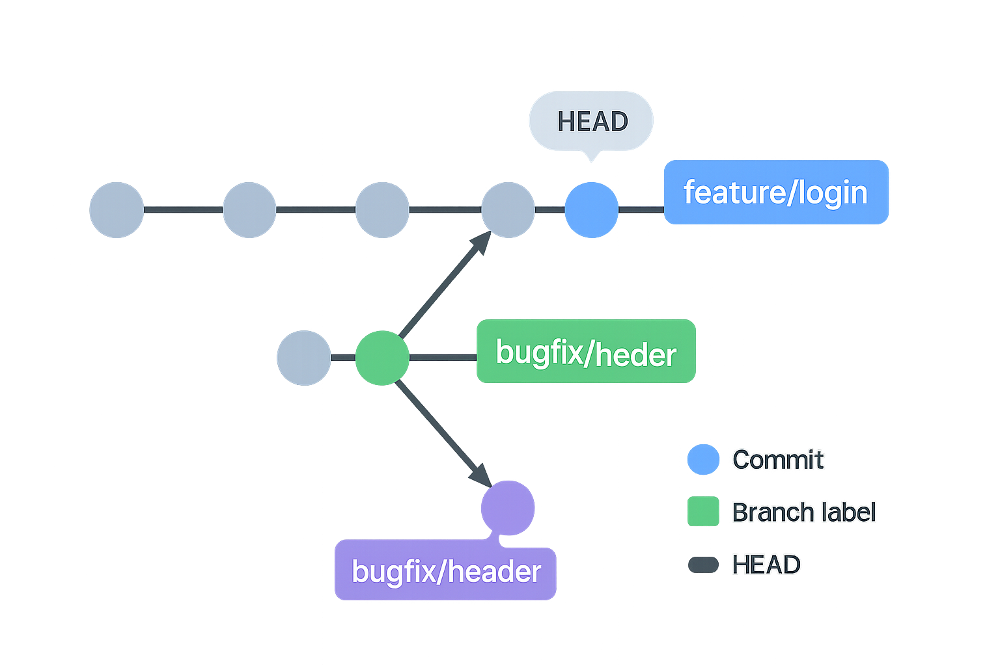

# Git e GitHub — lezione completa “da zero”

Questa è una lezione pensata per chi **non ha mai usato Git o GitHub**. Partiamo dal problema che risolvono, capiamo i concetti uno alla volta e poi li mettiamo in pratica con comandi reali. Alla fine avrai un flusso di lavoro quotidiano chiaro e saprai cosa fare quando qualcosa “si incastra”.

---

0. [Perché esistono Git e GitHub](#0)
1. [Concetti fondamentali (senza dare nulla per scontato)](#1)
2. [Installazione e prima configurazione](#2)
3. [Creare o clonare un repository](#3)
4. [Il ciclo di lavoro base (sempre uguale)](#4)
5. [Che cosa fa davvero `git add`](#5)
6. [`git commit` spiegato bene (cosa significano i flag)](#6)
7. [`.gitignore` (cosa non deve entrare nella storia)](#7)
8. [Vedere le differenze e la storia](#8)
9. [Che cos’è GitHub e quando lo usi](#9)
10. [Sincronizzare: `fetch`, `pull` e “divergent branches”](#10)
11. [Branching: perché esiste e come si usa](#11)
12. [Merge e Rebase: differenze pratiche](#12)
13. [Merge conflicts: come riconoscerli e risolverli](#13)
14. [Tornare indietro in sicurezza](#14)
15. [Parcheggiare il lavoro: `git stash`](#15)
16. [Lavorare bene con GitHub](#16)
17. [Esercizio guidato (fallo davvero)](#17)
18. [Errori tipici e soluzioni rapide](#18)
19. [Cheatsheet finale](#19)
20. [Riepilogo in una riga](#20)

---

<h2 id="0">0) Perché esistono Git e GitHub</h2>

Immagina di lavorare a un progetto e salvare i file come `progetto_finale_DEF2_vera.zip`. Dopo pochi giorni non ricordi più **cosa** è cambiato, **quando** e **perché**. Se collabori con qualcuno, scambiare file per email diventa un incubo.

**Git** risolve questo problema: tiene una **cronologia** del tuo progetto, come una macchina del tempo. Ogni “scatto” della macchina del tempo si chiama **commit**.  
**GitHub** è un sito che ospita una copia online (remota) del tuo progetto, così puoi **pubblicare**, **collaborare** e **fare backup**.

---

<h2 id="1">1) Concetti fondamentali (senza dare nulla per scontato)</h2>

* **Repository (repo)**: cartella del progetto che contiene una sottocartella nascosta `.git/`. Dentro `.git/` c’è tutta la **storia**.
* **Working tree**: i file “normali” sul disco, dove modifichi il codice.
* **Staging area (o index)**: una “lista di cose” che finiranno nel **prossimo commit**.
* **Commit**: uno snapshot dei file in staging, con un **messaggio** che spiega cosa hai fatto.
* **HEAD**: un puntatore che indica **dove sei** nella storia (di solito punta al **branch** su cui stai).
* **Branch**: una linea di sviluppo con un nome (es. `main`, `feature/login`). Serve per lavorare su una modifica **senza toccare** il codice stabile.
* **Remote (es. `origin`)**: la copia online del repo, tipicamente su GitHub.

**Esempio: Git come grafo di commit.** I branch sono etichette che puntano a un commit.



---

<h2 id="2">2) Installazione e prima configurazione</h2>

Verifica che Git sia installato:
```bash
git --version
```

Configura il tuo nome e la tua email (appaiono nella cronologia):
```bash
git config --global user.name  "Il Tuo Nome"
git config --global user.email "tu@email.com"
git config --global init.defaultBranch main
git config --global core.editor "code --wait"    # usa VS Code per i messaggi
```

Imposta un comportamento predefinito sensato per `git pull` (spiegazione al §10):
```bash
git config --global pull.rebase true
git config --global rebase.autoStash true
```

Accesso a GitHub **senza password** (consigliato):
```bash
ssh-keygen -t ed25519 -C "tu@email.com"
# copia ~/.ssh/id_ed25519.pub in GitHub → Settings → SSH and GPG keys
```

---

<h2 id="3">3) Creare o clonare un repository</h2>

### 3.1. Creare un nuovo repo **locale**
```bash
mkdir mio-progetto && cd mio-progetto
git init
```

### 3.2. Creare un nuovo repo **su GitHub**
* Vai su github.com → pulsante “New” → scegli un nome.
* Lascia vuoto se vuoi inizializzare da locale (oppure aggiungi un README).

Collega il remoto e pubblica:
```bash
git remote add origin git@github.com:utente/mio-progetto.git
git add .
git commit -m "Inizializzazione progetto"
git push -u origin main
```
`-u` stabilisce il collegamento tra il tuo branch locale e quello remoto (tracking). Da ora in poi, basterà `git push`.

### 3.3. Clonare un repo **già online** (caso più comune)
```bash
git clone git@github.com:utente/repo.git
cd repo
```

---

<h2 id="4">4) Il ciclo di lavoro base (sempre uguale)</h2>

1. **Guarda cosa è cambiato**
```bash
git status
```

2. **Scegli cosa fotografare** (staging)
```bash
git add file1 file2     # selettivo
git add .               # tutto ciò che è cambiato nella cartella corrente
```

3. **Scatta la foto** (commit)
```bash
git commit -m "feat: aggiunge form di login"
```

4. **Pubblica online** (push)
```bash
git push
```

> Finché non fai `git push`, le tue modifiche **restano solo sul tuo computer**.

---

<h2 id="5">5) Che cosa fa davvero `git add`</h2>

`git add` **prende la versione attuale** di un file e la **mette in staging**: quel contenuto finirà nel **prossimo commit**. Non crea un commit, non invia su GitHub.

* File **nuovo** → comincia a essere tracciato e messo in staging.
* File **già tracciato e modificato** → le modifiche vanno in staging.
* File **eliminato** → usa `git add -A` o `git add -u` per mettere in staging anche le cancellazioni.
* File **in `.gitignore`** → viene ignorato (puoi forzare con `git add -f`).

Errore comune: “non in stage” **non** significa “in `.gitignore`”. `.gitignore` è una **lista di esclusione**; lo staging è **cosa includere nel prossimo commit**.

Togli dallo staging:
```bash
git restore --staged path/file
```

---

<h2 id="6">6) `git commit` spiegato bene (cosa significano i flag)</h2>

### 6.1. Commit classico
```bash
git commit -m "messaggio"
```
* `-m` = **message**. Passi il messaggio direttamente da riga di comando.

### 6.2. Commit senza `git add` (solo file già tracciati)
```bash
git commit -am "messaggio"
```
* `-a` = **all (tracked)**: mette **automaticamente in staging** tutte le modifiche e le cancellazioni dei file **già tracciati**.  
  Non include **nuovi file**: per quelli serve **prima** `git add`.  
* `-am` è semplicemente la combinazione di `-a` e `-m`.

### 6.3. Modificare l’ultimo commit
```bash
git commit --amend
```
* Corregge il messaggio o aggiunge/toglie file dallo **stesso** commit precedente.  
  Se l’avevi già pubblicato, il push richiederà `--force-with-lease` sul tuo branch.

---

<h2 id="7">7) `.gitignore` (cosa non deve entrare nella storia)</h2>

Esempio tipico:
```gitignore
# file di sistema / editor
.DS_Store
.vscode/

# build e dipendenze
dist/
node_modules/

# segreti e configurazioni locali
.env
```

Se hai **già** committato qualcosa da ignorare:
```bash
git rm -r --cached path/da/ignorare
echo "path/da/ignorare" >> .gitignore
git commit -m "chore: aggiorna .gitignore e rimuove file dall'indice"
```

---

<h2 id="8">8) Vedere le differenze e la storia</h2>

```bash
git status -sb                    # panoramica compatta
git diff                          # differenze non in staging
git diff --staged                 # differenze in staging
git log --oneline --graph --decorate --all
git show <sha>                    # dettaglio di un commit
git blame path/file               # chi ha cambiato ogni riga
```

---

<h2 id="9">9) Che cos’è GitHub e quando lo usi</h2>

* È il “posto nel cloud” dove vive la **copia remota** del tuo repo.
* Serve per **collaborare**: apri **Pull Request** (PR) per proporre modifiche, ricevi **review**, fai girare **test automatici** (GitHub Actions).
* Puoi anche pubblicare siti statici con **GitHub Pages**.

Flusso tipico di collaborazione:
1. Crei un **branch** per una feature.  
2. Fai commit e push.  
3. Apri una **Pull Request** verso `main`.  
4. Qualcuno revisiona → risolvi i commenti → si fa **merge**.

---

<h2 id="10">10) Sincronizzare: `fetch`, `pull` e “divergent branches”</h2>

* `git fetch` **scarica** gli aggiornamenti dal remoto ma **non** tocca i tuoi file.  
* `git pull` = `fetch` **+** integrazione degli aggiornamenti nel tuo branch (merge o rebase).

Se vedi:
```
hint: You have divergent branches and need to specify how to reconcile them.
```
significa che **tu e il remoto avete entrambi nuovi commit**. Devi dire a Git **come** conciliarli:

* **Rebase** (storia lineare, consigliato per progetti personali):
  ```bash
  git pull --rebase
  ```
* **Merge** (storia ramificata, conservativa):
  ```bash
  git pull --no-rebase
  ```
* **Fast-forward only** (permetti solo avanzamenti lineari):
  ```bash
  git pull --ff-only
  ```

Impostare un default valido **una volta sola**:
```bash
git config --global pull.rebase true       # preferisci rebase lineare
# oppure:
git config --global pull.rebase false      # preferisci merge
# oppure:
git config --global pull.ff only           # solo fast-forward
```

---

<h2 id="11">11) Branching: perché esiste e come si usa</h2>

**Senza** branch: lavori sempre su `main`. Se rompi qualcosa, blocchi tutti.  
**Con** i branch: per ogni funzionalità apri una “linea di lavoro” dedicata; quando è pronta, la unisci a `main`.

Comandi essenziali:
```bash
git branch                        # elenco branch (asterisco = corrente)
git checkout -b feature/login     # crea e passa al nuovo branch
# equivalente moderno: git switch -c feature/login
git checkout main                 # torna a main  (o: git switch main)
git merge feature/login           # unisci in main
git branch -d feature/login       # elimina il branch (dopo il merge)
git push -u origin feature/login  # pubblica il branch su GitHub
```

**HEAD** indica su quale branch/commit stai lavorando.  
“Detached HEAD”? Sei su un commit senza branch: crea un branch se vuoi continuare da lì:
```bash
git switch -c hotfix/urgente
```

---

<h2 id="12">12) Merge e Rebase: differenze pratiche</h2>

**Merge**
* Crea, se necessario, un **commit di merge** che unisce due storie.  
* Pro: non riscrive la storia; sicuro per rami condivisi.  
* Contro: la cronologia include commit di merge e può sembrare “ramificata”.

**Rebase**
* “Riapplica” i tuoi commit sopra a una base più recente.  
* Pro: storia **lineare**, più facile da leggere.  
* Contro: **riscrive** i commit del branch; non farlo su commit già condivisi con altri (potresti dover fare `git push --force-with-lease`).

Esempi:
```bash
# Merge tipico
git switch main
git pull
git merge feature/x

# Rebase per pulire una feature prima della PR
git switch feature/x
git fetch origin
git rebase origin/main
# risolvi conflitti → git add <file> → git rebase --continue
```

---

<h2 id="13">13) Merge conflicts: come riconoscerli e risolverli</h2>

Quando due persone cambiano **la stessa parte** di un file in modi diversi, Git non sa quale versione tenere. Segnala un conflitto introducendo dei **marker** nel file:
```text
a = 1
<<<<<<< HEAD
b = 2
=======
b = 3
>>>>>>> 56782736387980937883
c = 3
```

Procedura:
```bash
# 1) scegli cosa tenere, rimuovi i marker
git add <file_risolto>
# 2) completa:
git rebase --continue    # se rebase
git commit               # se merge
# Annulla se serve:
# git rebase --abort | git merge --abort
```

Scorciatoie:
```bash
git checkout --ours   -- path/file
git checkout --theirs -- path/file
```

---

<h2 id="14">14) Tornare indietro in sicurezza</h2>

* **Scartare modifiche non committate**:
  ```bash
  git restore path/file
  git restore --source=HEAD -- .
  ```
* **Annullare un commit mantenendo la storia**:
  ```bash
  git revert <sha>
  ```
* **Riscrivere la storia locale** (attenzione):
  ```bash
  git reset --soft  <sha>   # tieni staging e working tree
  git reset --mixed <sha>   # default: svuota staging, tieni working tree
  git reset --hard  <sha>   # perdi modifiche locali
  ```
* **Allinearti esattamente al remoto**:
  ```bash
  git reset --hard origin/main      # o origin/master nei repo più vecchi
  ```
* **Paracadute**:
  ```bash
  git reflog
  ```

Se hai committato **segreti** (token, password): invalida/ruota le chiavi e riscrivi la storia con `git filter-repo` o **BFG Repo-Cleaner**.

---

<h2 id="15">15) Parcheggiare il lavoro: `git stash`</h2>

```bash
git stash            # salva le modifiche (file tracciati)
git stash -u         # include anche file non tracciati
git stash pop        # applica e rimuove dallo stash
git stash apply      # applica ma lascia nello stash
git stash -p         # “a pezzi”
```

---

<h2 id="16">16) Lavorare bene con GitHub</h2>

**Pull Request (PR) pulita**
1. `git checkout -b feature/x`  
2. commit piccoli, messaggi chiari  
3. `git fetch && git rebase origin/main` prima di aprire la PR  
4. apri PR su GitHub (descrivi cosa hai fatto, come testare)  
5. dopo review, **Squash merge** in `main`

**Fork**: copia di un repo altrui nel tuo account (per proporre modifiche).  
**GitHub Pages**: pubblica un sito statico
1. repo con `index.html`  
2. `git push`  
3. Settings → Pages → scegli branch → ottieni l’URL.

---

<h2 id="17">17) Esercizio guidato (fallo davvero)</h2>

```bash
mkdir prova-git && cd prova-git
git init
echo "ciao" > index.txt
git add index.txt
git commit -m "feat: aggiunge index.txt"

echo "riga2" >> index.txt
git commit -am "feat: aggiunge riga2 a index.txt"

git checkout -b feature/saluto
echo "hello" >> index.txt
git commit -am "feat: aggiunge hello"

git checkout main
git merge feature/saluto

git remote add origin git@github.com:TUO-UTENTE/prova-git.git
git push -u origin main
```

---

<h2 id="18">18) Errori tipici e soluzioni rapide</h2>

* **“non-fast-forward” al push** → `git pull --rebase` → risolvi conflitti → `git push`  
* **“detached HEAD”** → `git switch -c nome-branch`  
* **`.gitignore` non funziona** → `git rm -r --cached path/` → aggiorna `.gitignore` → commit

---

<h2 id="19">19) Cheatsheet finale</h2>

```bash
# Inizializza / clona
git init
git clone <URL> && cd repo

# Stato e differenze
git status -sb
git diff
git diff --staged

# Aggiungi e committa
git add -p
git commit -m "messaggio"
git commit -am "messaggio"     # -a = all (solo file già tracciati), -m = message

# Pubblica
git push -u origin <branch>

# Sincronizza
git fetch
git pull --rebase               # oppure --no-rebase / --ff-only

# Branching
git checkout -b feature/x       # o: git switch -c feature/x
git checkout main               # o: git switch main
git merge feature/x
git branch -d feature/x

# Conflitti (aiuti veloci)
git checkout --ours   -- path/file
git checkout --theirs -- path/file

# Undo sicuri
git restore path/file
git revert <sha>
git reset --hard origin/main
git reflog

# Ignora file
echo "dist/" >> .gitignore
git rm -r --cached dist/
git commit -m "chore: ignora dist"
```

---

<h2 id="20">20) Riepilogo in una riga</h2>

* **`git add`** prepara i file per il commit (staging).  
* **`git commit -m`** crea lo snapshot; **`-a`** include le modifiche dei file già tracciati; **`-am`** = `-a` + `-m`.  
* **`git push`** pubblica; **`git pull`** ti allinea (meglio con `--rebase`).  
* Lavora su **branch**, apri **PR**, risolvi i conflitti con metodo.
