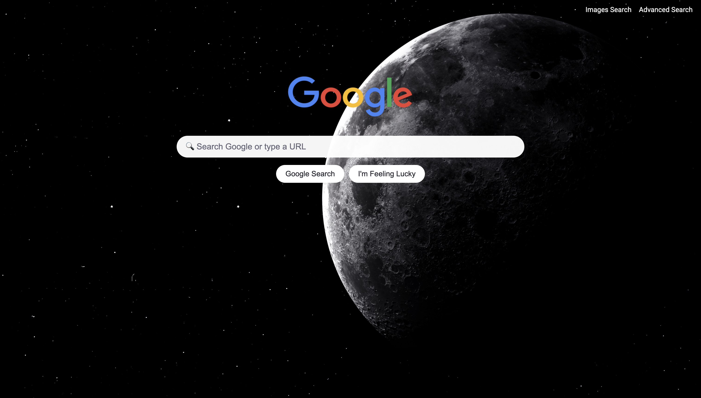

# Front-end Google Search — Descrizione del progetto

Questo progetto ricrea un **front-end minimale** per tre interfacce di Google:
- **Ricerca classica** (Search)
- **Ricerca Immagini** (Image Search)
- **Ricerca Avanzata** (Advanced Search)

Tutte le pagine sono statiche (HTML/CSS) e inviano i dati **direttamente a Google** tramite parametri **GET**.

---

## Anteprima del progetto

---

## Contenuto della cartella

> Il progetto richiede solo 3 pagine HTML e 1 foglio di stile condiviso, ma qui ho scelto di modularizzare il CSS e organizzare i file in cartelle per ordine e scalabilità.

~~~

.
├── index.html
├── README.md
└── src
    ├── css
    │   ├── advanced_search
    │   │   └── advanced.css
    │   ├── base.css
    │   ├── images_search
    │   │   └── images.css
    │   ├── landing
    │   │   ├── components.css
    │   │   ├── landing.css
    │   │   └── layout.css
    │   └── tokens.css
    ├── img
    │   ├── bg.webp
    │   └── google_logo.png
    │    
    │       
    └── pages
        ├── advanced.html
        └── images.html

~~~

> Non è obbligatorio per la consegna, ma questa organizzazione rende il progetto più manutenibile e facile da estendere.

---

## Cosa fa ogni file

### `index.html` (Google Search)
- Mostra una **barra di ricerca** centrata con **angoli arrotondati**.
- Due pulsanti sotto la barra:
  - **Google Search**: invia a `https://www.google.com/search?q=...`
  - **I’m Feeling Lucky**: invia a `https://www.google.com/search` con `q` e `btnI=1`, per aprire **direttamente il primo risultato** (potresti vedere un avviso di reindirizzamento, è normale).
- In alto a destra ci sono i link a **Immagini** e **Ricerca Avanzata**.

### `image.html` (Google Image Search)
- Stessa UX della ricerca classica, ma il form invia anche `tbm=isch`:
  - Endpoint: `https://www.google.com/search`
  - Parametri: `tbm=isch` + `q`
- In alto a destra c’è il link per tornare alla pagina principale.

### `advanced.html` (Google Advanced Search)
- Replica i 4 campi principali dell’Advanced di Google, **allineati a sinistra e impilati verticalmente**:
  - **Tutte queste parole** → `as_q`
  - **Questa parola o frase esatta** → `as_epq`
  - **Una qualsiasi di queste parole** → `as_oq`
  - **Nessuna di queste parole** → `as_eq`
- Pulsante **“Advanced Search”** in stile Google: **blu con testo bianco**.
- Il form invia a `https://www.google.com/search` con i parametri compilati.

### `styles.css`
- Stili comuni ispirati all’estetica pulita di Google:
  - Barra di ricerca **centrata** e con bordi **arrotondati**.
  - Pulsanti centrati sotto la barra.
  - **Navbar in alto a destra** con i link tra le pagine.
  - Layout responsive semplice.
  - Un tocco di personalizzazione 

---

## Come funziona (in breve)

- Le pagine usano `<form action="https://www.google.com/search" method="get">`.
- I campi `<input name="...">` diventano **parametri GET** nella URL (es. `?q=Harvard`).
- Parametri principali:
  - Ricerca classica: `q`
  - Immagini: `tbm=isch` + `q`
  - Avanzata: `as_q`, `as_epq`, `as_oq`, `as_eq`
  - I’m Feeling Lucky: `btnI=1` oltre a `q`

---

## Cosa dimostra questo progetto

- Uso pratico dei **form HTML** e delle **query string**.
- Comprensione dei parametri GET attesi da un servizio esterno (Google).
- Riproduzione di una **UI minimale** coerente con Google (centratura, bordi arrotondati, tipografia sobria).
- Separazione dei **contenuti** (HTML) dalla **presentazione** (CSS).

---

## Accessibilità & UX

- Campi di input con etichette o `aria-label`.
- Focus visibile e contrasto adeguato.
- Struttura degli heading logica.
- Layout semplice e prevedibile.

---

## Limitazioni

- Non c’è backend: le pagine inoltrano i dati **a Google**.
- Il tasto **I’m Feeling Lucky** può mostrare un **redirect notice** (comportamento previsto di Google).
- Le funzionalità e i risultati dipendono da Google e possono variare nel tempo.