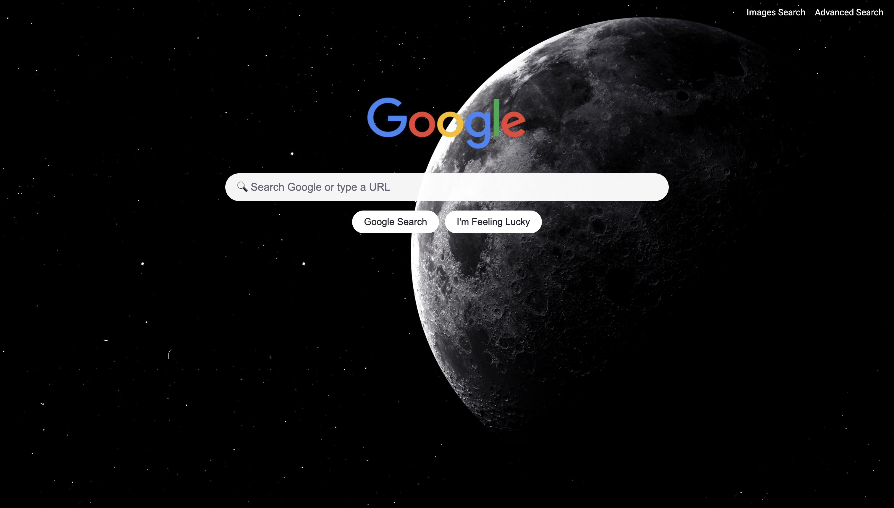

# Google Search Front-End — Project Description

This project recreates a **minimal front end** for three Google interfaces:
- **Standard Search**
- **Image Search**
- **Advanced Search**

All pages are static (HTML/CSS) and send data **directly to Google** via **GET** parameters.

---

## Project Preview

---

## Folder Contents

> The project only requires 3 HTML pages and 1 shared stylesheet, but here I chose to **modularize the CSS** and organize files into folders for clarity and scalability.

~~~

.
├── index.html
├── README.md
└── src
    ├── css
    │   ├── advanced_search
    │   │   └── advanced.css
    │   ├── base.css
    │   ├── images_search
    │   │   └── images.css
    │   ├── landing
    │   │   ├── components.css
    │   │   ├── landing.css
    │   │   └── layout.css
    │   └── tokens.css
    ├── img
    │   ├── bg.webp
    │   └── google_logo.png
    │    
    │       
    └── pages
        ├── advanced.html
        └── images.html

~~~

> This organization is **not required** for submission, but it makes the project easier to maintain and extend.

---

## What Each File Does

### `index.html` (Google Search)
- Displays a **centered search bar** with **rounded corners**.
- Two buttons below the bar:
  - **Google Search**: sends to `https://www.google.com/search?q=...`
  - **I’m Feeling Lucky**: sends to `https://www.google.com/search` with `q` and `btnI=1`, opening **the first result directly** (you may see a redirect notice; that’s normal).
- Top-right links to **Images** and **Advanced Search**.

### `image.html` (Google Image Search)
- Same UX as standard search, but the form also sends `tbm=isch`:
  - Endpoint: `https://www.google.com/search`
  - Params: `tbm=isch` + `q`
- Top-right link back to the main page.

### `advanced.html` (Google Advanced Search)
- Mirrors Google’s 4 main advanced fields, **left-aligned and stacked vertically**:
  - **All these words** → `as_q`
  - **This exact word or phrase** → `as_epq`
  - **Any of these words** → `as_oq`
  - **None of these words** → `as_eq`
- **“Advanced Search”** button in Google style: **blue with white text**.
- The form submits to `https://www.google.com/search` with the provided parameters.

### `styles.css`
- Shared styles inspired by Google’s clean aesthetic:
  - **Centered** search bar with **rounded corners**.
  - Buttons centered beneath the bar.
  - **Top-right navbar** with page links.
  - Simple responsive layout.
  - A touch of personalization.

---

## How It Works (at a glance)

- Pages use `<form action="https://www.google.com/search" method="get">`.
- `<input name="...">` fields become **GET parameters** in the URL (e.g., `?q=Harvard`).
- Main parameters:
  - Standard Search: `q`
  - Images: `tbm=isch` + `q`
  - Advanced: `as_q`, `as_epq`, `as_oq`, `as_eq`
  - I’m Feeling Lucky: `btnI=1` in addition to `q`

---

## What This Project Demonstrates

- Practical use of **HTML forms** and **query strings**.
- Understanding of the GET parameters expected by an external service (Google).
- Reproduction of a **minimal UI** aligned with Google (centering, rounded corners, clean typography).
- Separation of **content** (HTML) from **presentation** (CSS).

---

## Accessibility & UX

- Input fields with visible labels or `aria-label`.
- Visible focus and adequate contrast.
- Logical heading structure.
- Simple, predictable layout.

---

## Limitations

- No backend: pages **forward data to Google**.
- The **I’m Feeling Lucky** button can show a **redirect notice** (expected Google behavior).
- Features and results depend on Google and may change over time.